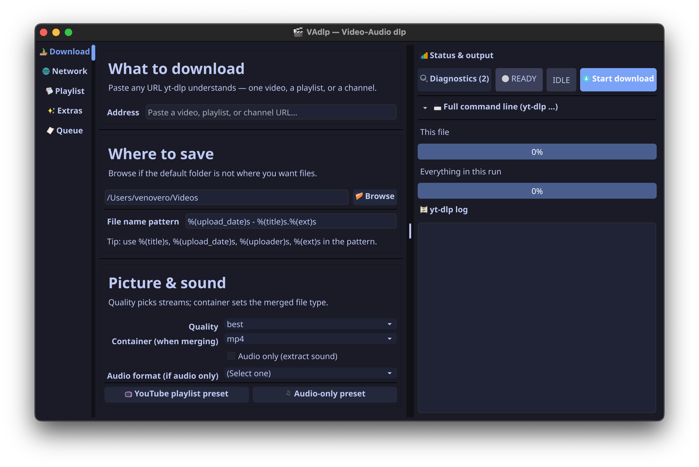
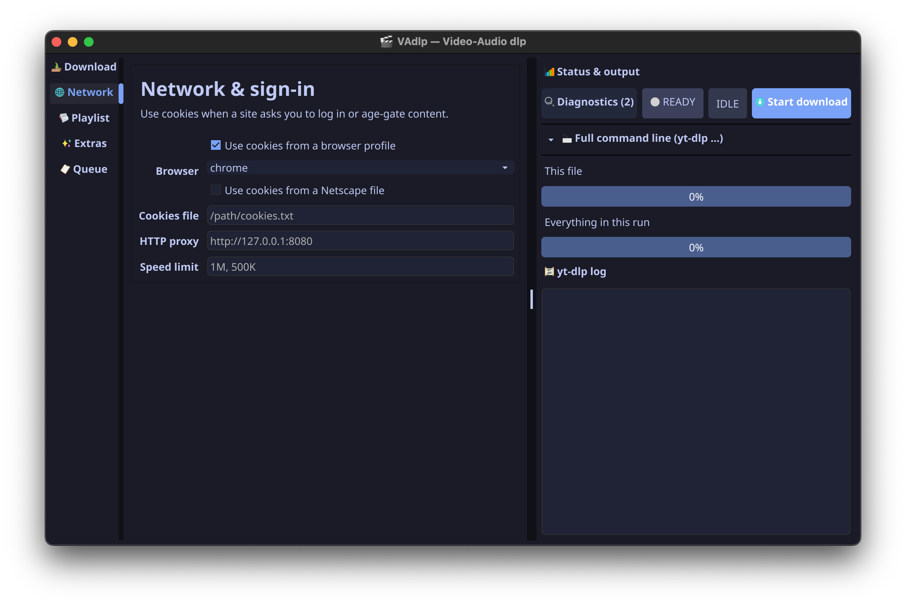
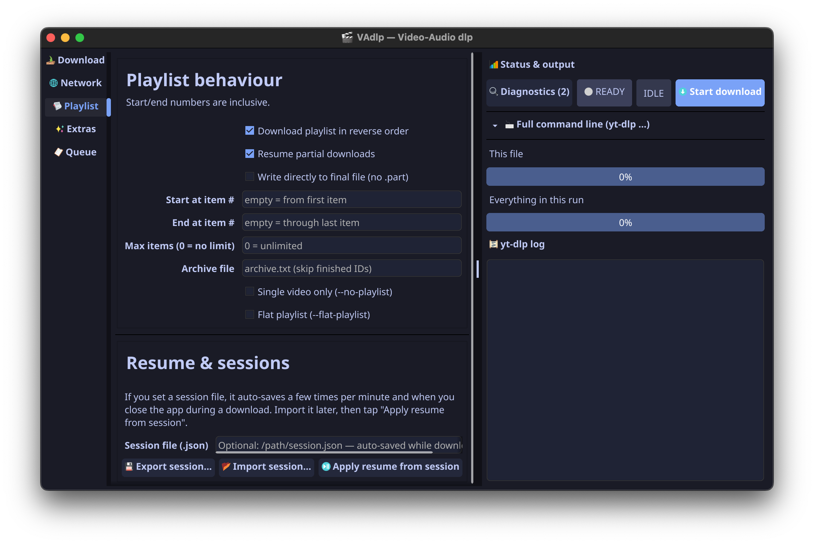
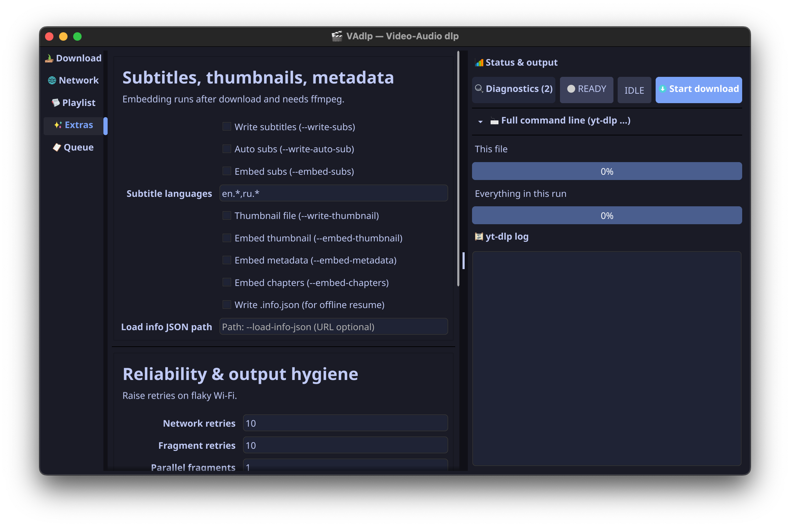
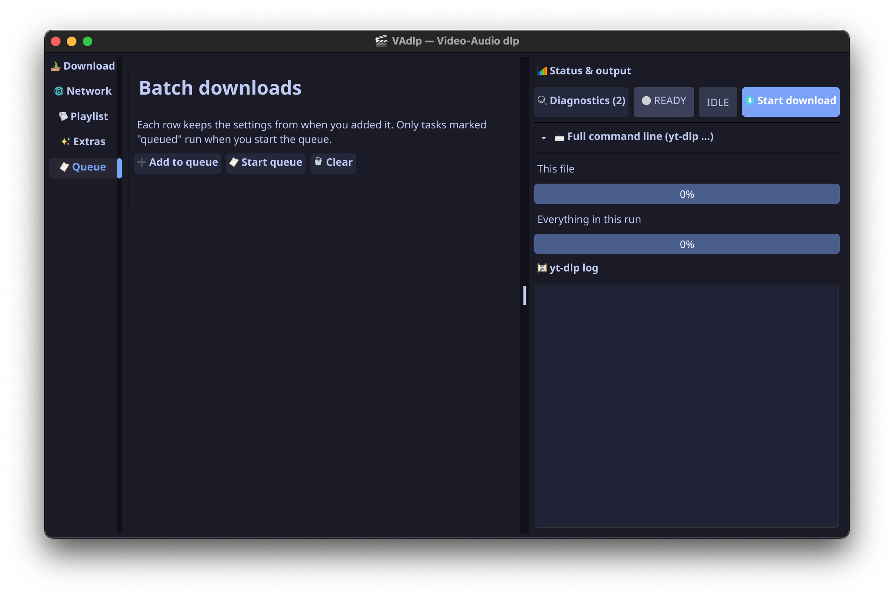

# VAdlp

[](https://github.com/venedicus/VAdlp/actions/workflows/ci.yml)

Desktop GUI for [yt-dlp](https://github.com/yt-dlp/yt-dlp). Go + [Fyne](https://fyne.io/).

Build the command, run downloads, keep a queue, save profiles.

## Screenshots

<div style="display: flex; overflow-x: auto; white-space: nowrap; gap: 10px;">
  
  
  
  
  
</div>

## Features

- Live preview of the yt-dlp command
- Download tab: URL, batch list, output path and filename template
- Format: custom `-f` string, merge container, quick presets (1080p, 4K, audio-only, …)
- Profiles on the download tab: save, load, rename, delete (URL is not stored in a profile)
- Queue with reorder, retry, cancel, parallel workers
- Network: cookies (browser or file), proxy, rate limit, login
- Playlist limits, session export/import
- Extras: subtitles, thumbnails, SponsorBlock, extra flags
- Format list from `yt-dlp -J` with thumbnails
- Tools: yt-dlp update, ffmpeg/deno install, language (en/ru), open output folder
- yt-dlp auto-install on first start if missing

## Requirements

| | |
|---|---|
| Go | 1.25+ |
| yt-dlp | runtime; offered for install if missing |
| ffmpeg | recommended for merge and `-x` |
| gcc | required to build Fyne (CGO) |

## Download

Pre-built binaries: [Releases](https://github.com/venedicus/VAdlp/releases) (tags `v*`, e.g. `v0.1.1`).

Platforms: Linux (amd64, arm64), Windows (amd64), macOS (amd64, arm64; `.dmg` + tarball). Optional AppImage may appear when the CI step succeeds. See [RELEASE.md](RELEASE.md) for checksums and verification.

## Build and run

Fyne needs CGO (`CGO_ENABLED=1`) and a C compiler. The binary is written to `bin/` (not the repo root).

```bash
git clone https://github.com/venedicus/VAdlp.git
cd VAdlp
go build -o bin/vadlp ./cmd/vadlp
./bin/vadlp
```

Windows (PowerShell): `go build -o bin/vadlp.exe ./cmd/vadlp` then `.\bin\vadlp.exe`, or `.\build.ps1`.

macOS/Linux: `./build.sh` is equivalent to the `go build` line above.

With [Task](https://taskfile.dev):

```bash
task run      # build into bin/ and run
task check    # fmt, vet, test, build (with version ldflags)
```

`go build ./cmd/vadlp` without `-o` only drops `vadlp` / `vadlp.exe` in the current directory; prefer `-o bin/vadlp` so the path matches `task build` and the docs.

`go run ./cmd/vadlp` works but relinks the Fyne binary each time; on Windows that is usually much slower than `task run` or a plain `go build`.

The first Fyne build on a machine needs a C compiler and can take several minutes. Rebuilds are normally a few seconds.

### Windows (gcc)

Install MinGW-w64 ([MSYS2](https://www.msys2.org/) is fine), put `gcc` on `PATH`, open a new shell, check `go env CGO_ENABLED` is `1`.

### Linux (Fyne deps)

Debian/Ubuntu:

```bash
sudo apt-get install gcc libgl1-mesa-dev xorg-dev libxkbcommon-dev
```

## yt-dlp lookup

1. `<app>/bin/yt-dlp[.exe]`
2. `<app>/yt-dlp[.exe]`
3. `<app>/../bin/`
4. `./bin/` from cwd
5. `PATH`
6. Download dialog (GitHub latest release)

## Layout

```text
cmd/vadlp/              main
internal/core/          config, command builder, profiles, session, history
internal/downloader/    yt-dlp process, progress parsing
internal/updater/       yt-dlp, ffmpeg, deno
internal/settings/      settings.json
internal/i18n/          en, ru
internal/ui/fyne/       UI
internal/version/       build version (ldflags)
```

Profiles on disk: `%AppData%\vadlp\profiles\` (Windows) or `~/.config/vadlp/profiles/`.

## CI and quality

On every push/PR to `main`:

- `golangci-lint`, `gofmt`, `go vet`, tests, `govulncheck`
- Native builds on Linux (amd64 + arm64), Windows, macOS (arm64 + amd64)

Details: [CONTRIBUTING.md](CONTRIBUTING.md), workflows in [.github/workflows](.github/workflows).

## Contributing

See [CONTRIBUTING.md](CONTRIBUTING.md). Security: [SECURITY.md](SECURITY.md).

## License

MIT
